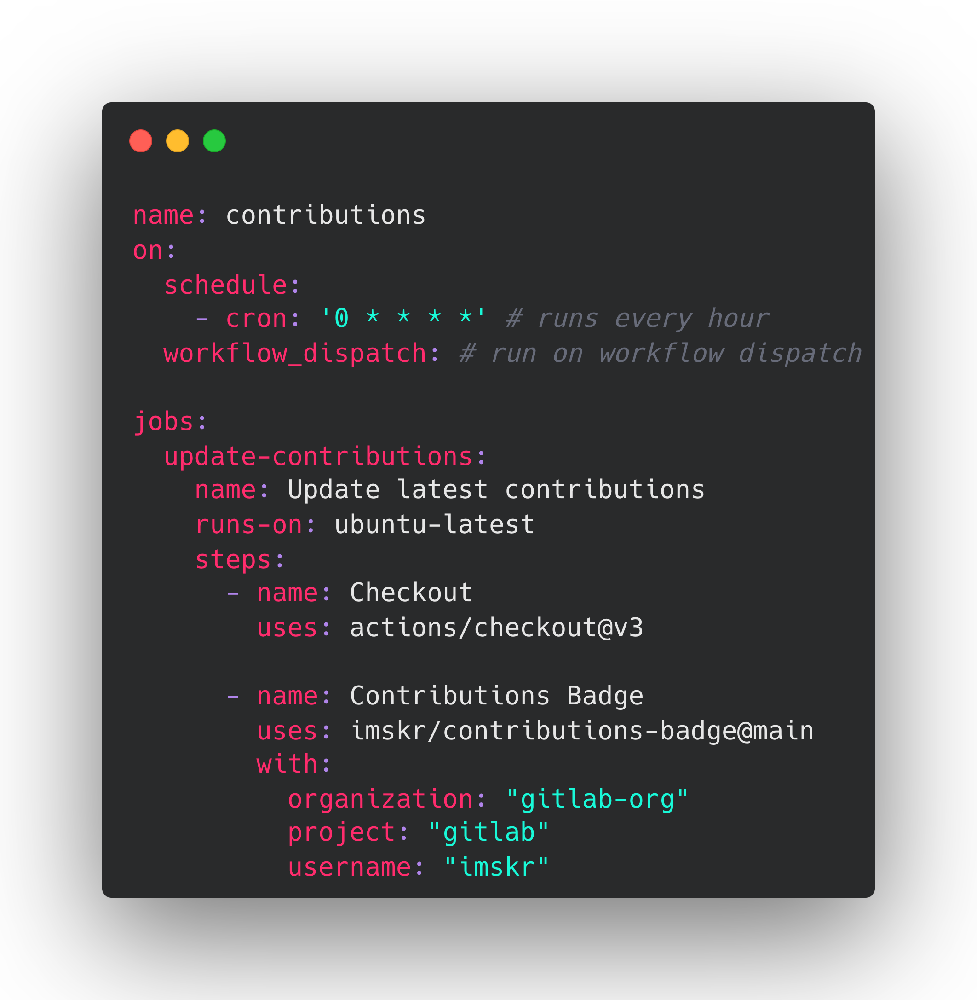

# contributions-badge

> A github action workflow for showcasing your number of merged pull requests in profile's README dynamically

<p align="center">
    <a href="https://github.com/imskr/contributions-badge/releases"></a>
    <a href="https://github.com/imskr/contributions-badge/actions/workflows/build.yml"></a>
    <a href="https://github.com/imskr/contributions-badge/issues"></a>
</p>
<hr noshade>

## Usage

1. Go to your repository
2. Add the following to your **README.md** file, you can use any title. Just make sure that you use the following in your readme. The workflow will replace this comment with the number of merged pull requests:

    ```markdown
    <!-- MERGED_PULL_REQUESTS_START -->
    Pull requests merged in
    <!-- MERGED_PULL_REQUESTS_END -->
    ```

3. Create a folder `.github/workflows` inside root of the repository if it doesn't exists.
4. Create a new file `contributions.yml`  inside `.github/workflows/`  with the following contents or copy it from [here](./examples/contributions.yml):



5. Replace the above `organization`, `project` and `username` with your data.
6. Commit and wait for it to run automatically, or you can also trigger it manually to see the result instantly.

> Currently we are only supporting public projects on GitLab

## Results


## Support

<p>
    <a href="https://buymeacoffee.com/imskr" target="_blank"></a>
</p>